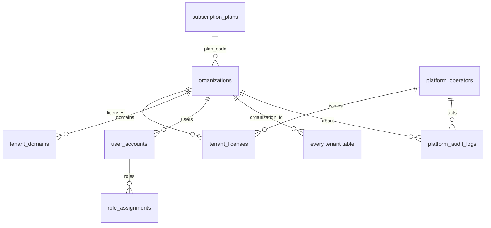

# OYUNS ERP — multi-tenant SaaS architecture

This turns the single-company deployment on the VPS (`erp.oyuns.mn`, Dokploy) into **OYUNS ERP**, a multi-tenant B2B platform. The existing company, with all of its data, becomes the **primary tenant**. On top of that, the platform gets an operator (superadmin) console, signed license keys, per-tenant branding and seat quotas.

| Decision | Choice |
|---|---|
| Isolation pattern | One shared PostgreSQL schema, keyed by tenant (`organization_id`). PostgreSQL row-level security (RLS) plus an ORM guard give defence in depth. |
| Tenant table | `organizations`, extended in place. It already is the tenant key of ~150 tables. |
| Tenant resolution | Host first (`<slug>.<TENANT_BASE_DOMAIN>` or a verified custom domain), then the signed access token. Shared hosts use the token. |
| License tokens | Ed25519-signed JWS (asymmetric, offline verification) plus a central registry (`tenant_licenses`) for revocation and state. |
| Seat enforcement | App-level check that locks the tenant row, plus a database trigger as the backstop. |
| Operators | A separate `platform_operators` table, a separate token signing key and audience, and optional console-host and CIDR pinning. |

Code map: migrations `backend/alembic/versions/b3c4d5e6f7a8_multi_tenant_saas.py` and `d4e8f1a2b3c9_tenant_telegram_bots_and_domains.py` (§8, §9) · `app/core/tenancy.py` (context, ORM guard, tenant directory, gates) · `app/core/tenant_middleware.py` · `app/services/licensing.py` · `app/services/tenant_service.py` (seats, activation, revocation) · `app/services/tenant_branding.py` · `app/routers/tenant.py` (`/v1/tenant`) · `app/routers/platform.py` (`/v1/platform`) · `app/models/platform.py` · `scripts/platform_admin.py` · `ops/sql/oyuns_app_role.sql`. Frontend: `src/api/tenancy.ts`, `src/components/TenantLicenseSettings.tsx`, `TenantBrandingSettings.tsx`, `TenantGate.tsx`, `src/theme/tenantBranding.ts`, `src/console/*` (the `/platform` console). Telegram bots and custom domains: `app/services/telegram_bots.py`, `app/bot/main.py` (multi-bot runner), `app/bot/handshake_handlers.py`, `app/services/custom_domains.py`, `src/components/TenantTelegramBotSettings.tsx`, `TenantDomainSettings.tsx`.

---

## 1. Architectural blueprint

### 1.1 Shared schema + RLS vs schema-per-tenant

| | Shared schema, `tenant_id` + RLS (**chosen**) | Schema per tenant |
|---|---|---|
| Fit with today's data | ~150 tables already carry `organization_id`, and every query already filters on it. The legacy company becomes tenant 1 with a data backfill only. | Every row would have to move into a new schema, and 100+ Alembic revisions would need multi-schema replay. |
| VPS resources | One catalog, one connection pool, one set of indexes and one autovacuum workload. Memory stays flat as tenants grow. | Catalog bloat (N × 200 tables, indexes and sequences) and more planner and vacuum work. The asyncpg statement cache is poisoned by `search_path` switching. |
| Migrations | One `alembic upgrade head`. | Loop over N schemas, each able to fail halfway. Drift between tenants is likely. |
| Cross-tenant operator views | Plain SQL in the system context (seat counts, audits). | `UNION` across schemas or a separate catalog. |
| Isolation strength | Logical. It is enforced by three independent layers (below). Needs the app role to be non-superuser. | Stronger by default, but only if the `search_path` is never wrong. The same class of bug still exists. |
| Per-tenant backup/restore | `pg_dump` with a `WHERE organization_id =` export (or logical export). This is the one real cost. | `pg_dump -n schema`. |

**Recommendation:** shared schema + RLS. Migration simplicity and VPS efficiency both clearly favour it, and the codebase is already organised around a tenant key. Schema-per-tenant stays an option for a future "dedicated" tier that gets a separate database, not a separate schema.

### 1.2 Defence in depth

1. **Application filters.** Endpoints keep filtering by `actor.organization_id`, as they do today.
2. **ORM guard** (`install_tenant_guards`). When a tenant is bound to the request:
   - Loading a row whose `organization_id` belongs to another tenant raises `TenantBoundaryViolation`. That becomes HTTP 403 `tenant_boundary`, and the details are logged.
   - New rows without a tenant are stamped with the current one.
   - Writing or deleting another tenant's row raises.

   This catches a forgotten `WHERE` clause even when the database user bypasses RLS.
3. **PostgreSQL RLS.** Every table with `organization_id` (plus `organizations` by `id`) runs `ENABLE` + `FORCE ROW LEVEL SECURITY` with policy `tenant_isolation USING/WITH CHECK tenant_row_visible(organization_id)`. The API publishes the tenant per transaction with `set_config('app.tenant_id', …, true)` (a Session `after_begin` hook). Raw SQL, Core statements and column-only selects are filtered too. `WITH CHECK` rejects cross-tenant inserts.
4. **Request middleware** (`TenantContextMiddleware`). It checks that host and token agree, gates tenant status, licence and licensed modules, and rejects tenant tokens on the operator console.

The *system context* is what runs with no tenant bound: the bot, the scheduler, migrations and the console. There, the ORM guard is idle and RLS stays permissive. `ALTER DATABASE … SET app.rls_strict = on` makes RLS require an explicit `app.system_context = on`. The console, the tenant directory and Alembic already declare it; workers need it before strict mode can be enabled.

> ⚠️ RLS never applies to superusers or `BYPASSRLS` roles. The docker `POSTGRES_USER` (`tracker`) is a superuser. Until the API runs as `oyuns_app` (step 5 of the rollout), isolation rests on layers 1, 2 and 4. The console's **System** page and `python -m scripts.platform_admin rls-status` report whether RLS is effective.

### 1.3 Request data flow

```mermaid
sequenceDiagram
    participant B as Browser / app
    participant P as Traefik → nginx (/api)
    participant M as TenantContextMiddleware
    participant D as FastAPI deps (get_actor)
    participant S as SQLAlchemy session
    participant PG as PostgreSQL (RLS)
    B->>P: GET acme.oyunserp.com/api/v1/tasks  (Bearer JWT: org=2)
    P->>M: Host: acme.oyunserp.com
    M->>M: host → tenant 2 (slug, cached 30 s)<br/>token org claim = 2 ✓ (else 403 tenant_mismatch)
    M->>M: tenant status / licence / module gate<br/>(403 suspended · 402 licence · 403 feature)
    M->>D: contextvar tenant = 2
    D->>S: actor_from_token → bind_tenant(2)
    S->>PG: BEGIN; SELECT set_config('app.tenant_id','2',true)
    S->>PG: SELECT … FROM tasks WHERE organization_id = 2
    PG-->>S: rows passing tenant_row_visible()
    S-->>D: ORM load guard: every row.organization_id == 2
```

**Tenant resolution rules** (`classify_host`):

| Host | Tenant |
|---|---|
| In `PLATFORM_ROOT_HOSTS`, an IP address, `TENANT_BASE_DOMAIN` itself, or a reserved label (`www`, `app`, `console`, …) | From the access token. Anonymous requests run in the system context (login). |
| `<slug>.<TENANT_BASE_DOMAIN>` | The tenant with that slug. An unknown slug gets 404 `tenant_not_found`. |
| Any other host | A verified `tenant_domains.hostname`. An unknown host follows `TENANT_UNKNOWN_HOST_POLICY` (`shared` by default, or `reject`). |

A token from tenant A presented on tenant B's host gets **403 `tenant_mismatch`**. Login on a tenant host only matches that tenant's accounts. Logins (`user_accounts.email`) are unique platform-wide, so the shared host can find the account's tenant from the login alone.

### 1.4 Roles

| Role | Identity | Scope |
|---|---|---|
| **Superadmin** | `platform_operators.role = superadmin`. It has its own login (`/v1/platform/auth/login`), a token with `kind=platform` and `aud=oyuns-platform`, signed with `PLATFORM_TOKEN_SECRET` (derived from `SECRET_KEY` when empty). | Everything under `/v1/platform`: tenants, plans, licences, domains, operators. Everything is audited in `platform_audit_logs`. |
| **Support operator** | `platform_operators.role = support` | Console read-only. |
| **Tenant Admin** | `role_assignments.role = admin` inside one tenant | Workspace settings, users up to the seat quota, licence activation, branding. |
| **Tenant User** | Other tenant roles (`member`, `manager`, `hr`, …) | Only its own tenant, narrowed further by existing role rules. |

Isolation guarantees:

- A tenant token is never accepted by `/v1/platform/*`: a different key and audience, and `get_operator` refuses when a tenant is bound.
- An operator token never opens a workspace: it doesn't validate with `SECRET_KEY`.
- The console returns 404 on tenant domains. It can be pinned to `PLATFORM_CONSOLE_HOSTS` and `PLATFORM_ALLOWED_CIDRS`.

### 1.5 Licence tokens: central validation API vs asymmetric verification

**Chosen: a hybrid.**

- **Authenticity comes from asymmetric crypto.** Tokens are compact JWS with `alg=EdDSA` (Ed25519). Only the issuer holds the private key. Every verifier needs only the public key: this API, a future self-hosted install, support tooling. A leaked application server therefore cannot mint licences.
- **State comes from the central registry.** `tenant_licenses` stores every issued token (`jti`, SHA-256, status). Revocation, supersession and "one active licence per tenant" are checked at activation, and the tenant row mirrors the active licence so every request is gated without re-verifying.

A pure central validation API would make every workspace depend on a license server being reachable. Pure offline verification cannot revoke. The hybrid keeps both properties.

Token format:

```
header  {"alg":"EdDSA","typ":"oyuns-license+jwt","kid":"oyuns-license-1"}
claims  {"iss":"oyuns-erp-licensing","aud":"oyuns-erp","sub":"<tenant public_id>","tenant":"acme",
         "jti":"<licence uuid>","iat":…,"nbf":…,"exp":…,"seats":25,
         "features":["contracts","crm"],"plan":"professional","cycle":"yearly","ver":1}
```

Verification (`licensing.verify_token`) checks, in order: structure and size (≤ 8 KB), `alg` and `typ`, known `kid`, the Ed25519 signature, `ver`, `iss`, `aud`, the claim types, `nbf`/`exp` (60 s leeway), and `sub` == this tenant's `public_id`. Every failure has a stable code (`bad_signature`, `expired`, `tenant_mismatch`, …) that the UI shows.

```mermaid
sequenceDiagram
    participant O as Operator console
    participant API as /v1/platform
    participant R as tenant_licenses
    participant T as Tenant admin UI
    participant V as /v1/tenant/license
    O->>API: POST /tenants/{id}/licenses {seats, features, expiry}
    API->>API: sign(Ed25519 private key, kid)
    API->>R: INSERT status=issued, sha256(token)
    API-->>O: token (shown once, re-readable by operators)
    O-->>T: send token to the customer
    T->>V: POST /license/verify (preview) → /license/activate
    V->>V: verify signature + claims + tenant binding
    V->>R: row by jti: not revoked/superseded, hash matches
    V->>V: seats ≥ active users? (else seats_below_usage)
    V->>R: previous active → superseded; this → active
    V->>V: organizations.seat_limit/features/license_expires_at ← licence
```

- **Renew / upgrade:** `POST /v1/platform/licenses/{id}/renew` issues a successor. By default its term runs on from the previous expiry, and seats and modules can change. Activating it supersedes the old licence, either by the tenant or by the operator (`activate: true`).
- **Revoke:** the licence becomes `revoked`. If it was active, `license_expires_at` is cleared and the tenant is limited to the licence screens. A revoked token can never be activated again.
- **Expiry:** once expired, a tenant gets `LICENSE_GRACE_DAYS` of grace (a warning, full access). After that, every API except `/v1/auth/*` and `/v1/tenant/*` returns **402 `license_expired`**.
- **Key rotation:** generate a new pair (`platform_admin generate-license-keys --kid oyuns-license-2`), switch `LICENSE_SIGNING_*` to it, and add the old public key to `LICENSE_PUBLIC_KEYS`. Tokens keep verifying by `kid`.
- **Key custody:** keep `LICENSE_SIGNING_PRIVATE_KEY` in the secret store. For stricter separation, run the console as its own service with the private key. The tenant-facing API then gets only `LICENSE_PUBLIC_KEYS`, and issuing there returns 503 `signing_unavailable`.

### 1.6 Seats

A seat is a `user_accounts` row with `status` in `active`, `invited` or `locked` that is not a system agent (`preferences.system_agent`). Disabled accounts, and workers deactivated by HR (which disables their login), free their seat.

- `ensure_seat_available(db, org)` locks the tenant row (`SELECT … FOR UPDATE`), counts, and raises **409 `seat_limit_reached`** with `used` and `limit`. It is called on every path that creates or re-enables a login:
  - admin creates an account or sends an invitation (`/v1/auth/accounts`, `/accounts/invite`);
  - an account is re-activated (`PATCH /accounts/{id}`);
  - the first Telegram login;
  - an HR invite is bound (web and bot);
  - the console creates a tenant's first admin.
- **Backstop:** the trigger `enforce_tenant_seat_limit` (BEFORE INSERT / UPDATE OF status, organization_id, preferences). It uses the same rule, locks the same row and raises SQLSTATE `OY001`. The API maps that error to the same 409.
- **Real-time accounting:** `GET /v1/tenant/seats` and `/v1/tenant/context` return used, limit and available. Settings → Users shows a seat meter and an upgrade prompt when full. The licence page shows the meter and the licence preview warns when a key has fewer seats than active users. Activating such a key is refused (`seats_below_usage`).

### 1.7 Licensed modules

`TENANT_FEATURES` lists `crm`, `budget`, `payroll`, `contracts`, `ai_assistant` and `legacy_workspace`. Everything else is the core workspace: people/HR, tasks, calendar, chat, worktime, reports, plans, files and the accounting core.

- The middleware maps route prefixes to features (`FEATURE_ROUTES`) and answers **403 `feature_not_licensed`**.
- The ERP module switches (`/v1/erp/meta`, `PUT /admin/modules`) cannot enable an unlicensed module, and the navigation hides it.
- **`legacy_workspace`** covers the check-in survey tools and the old admin screens (`/questions`, `/schedules`, `/answers`, `/manager-settings`, `/dashboard`, `/tasks`, `/auth/*` legacy, …). These read tables that had no tenant key, so they stay primary-tenant only, whatever a licence says.

### 1.8 Branding

`organizations.branding` holds `display_name`, `logo_url`, `favicon_url`, `primary_color` and `secondary_color`. It is edited by tenant admins (Settings → Profile & branding) or by operators. `GET /v1/tenant/branding` is public and host-resolved (the login page).

The frontend re-seeds the Astryx theme from the tenant's primary colour (`tenantTheme`). It also sets the legacy CSS accent variables, the title and the favicon (`applyDocumentBranding`). Logos uploaded under "Лого ба theme" remain the fallback.

---

## 2. Database schema

The full DDL lives in migration `b3c4d5e6f7a8`. The essentials:

```sql
-- tenants ≡ organizations (extended in place; FKs from ~150 tables are kept)
ALTER TABLE organizations
  ADD slug text NOT NULL UNIQUE CHECK (slug ~ '^[a-z0-9](?:[a-z0-9-]{0,61}[a-z0-9])?$'),
  ADD status text NOT NULL DEFAULT 'active'
      CHECK (status IN ('pending_activation','active','suspended','terminated')),
  ADD is_primary boolean NOT NULL DEFAULT false,          -- unique partial index WHERE is_primary
  ADD plan_code text REFERENCES subscription_plans(code) ON UPDATE CASCADE ON DELETE SET NULL,
  ADD billing_cycle text NOT NULL DEFAULT 'monthly',      -- monthly|quarterly|yearly|custom
  ADD seat_limit integer CHECK (seat_limit IS NULL OR seat_limit >= 0),   -- NULL = unlimited
  ADD features jsonb NOT NULL DEFAULT '[]',               -- mirror of the active licence
  ADD license_required boolean NOT NULL DEFAULT true,     -- false = grandfathered primary
  ADD license_expires_at timestamptz,
  ADD branding jsonb NOT NULL DEFAULT '{}',
  ADD contact_email text, ADD status_reason text,
  ADD suspended_at timestamptz, ADD terminated_at timestamptz;

CREATE TABLE subscription_plans (
  id serial PRIMARY KEY, code text NOT NULL UNIQUE, name text NOT NULL, description text,
  seat_limit integer CHECK (seat_limit IS NULL OR seat_limit > 0),
  features jsonb NOT NULL DEFAULT '[]', billing_cycle text NOT NULL DEFAULT 'monthly',
  price_amount numeric(14,2), currency varchar(3) NOT NULL DEFAULT 'MNT',
  is_active boolean NOT NULL DEFAULT true, sort_order integer NOT NULL DEFAULT 0,
  created_at timestamptz NOT NULL DEFAULT now(), updated_at timestamptz NOT NULL DEFAULT now());
-- seeded: starter (10 seats), professional (50), enterprise (500)

CREATE TABLE tenant_licenses (
  id serial PRIMARY KEY,
  public_id uuid NOT NULL UNIQUE DEFAULT gen_random_uuid(),         -- = token jti
  organization_id integer NOT NULL REFERENCES organizations(id) ON DELETE CASCADE,
  plan_code text, seat_limit integer NOT NULL CHECK (seat_limit >= 1),
  features jsonb NOT NULL DEFAULT '[]', billing_cycle text NOT NULL DEFAULT 'monthly',
  valid_from timestamptz NOT NULL, expires_at timestamptz NOT NULL CHECK (expires_at > valid_from),
  status text NOT NULL DEFAULT 'issued' CHECK (status IN ('issued','active','superseded','revoked')),
  key_id text NOT NULL, token text NOT NULL, token_sha256 varchar(64) NOT NULL UNIQUE,
  supersedes_id integer REFERENCES tenant_licenses(id) ON DELETE SET NULL,
  notes text, issued_by_operator_id integer REFERENCES platform_operators(id) ON DELETE SET NULL,
  issued_at timestamptz NOT NULL DEFAULT now(),
  activated_at timestamptz, activated_by_account_id integer REFERENCES user_accounts(id) ON DELETE SET NULL,
  activated_by_operator_id integer REFERENCES platform_operators(id) ON DELETE SET NULL,
  revoked_at timestamptz, revoked_reason text,
  revoked_by_operator_id integer REFERENCES platform_operators(id) ON DELETE SET NULL,
  created_at timestamptz NOT NULL DEFAULT now(), updated_at timestamptz NOT NULL DEFAULT now());
CREATE UNIQUE INDEX uq_tenant_licenses_active ON tenant_licenses (organization_id) WHERE status = 'active';

-- users ≡ user_accounts (unchanged shape): organization_id NOT NULL FK, email UNIQUE platform-wide,
-- status IN ('invited','active','locked','disabled'); roles in role_assignments.
CREATE TRIGGER trg_user_accounts_seat_limit BEFORE INSERT OR UPDATE OF status, organization_id, preferences
  ON user_accounts FOR EACH ROW EXECUTE FUNCTION enforce_tenant_seat_limit();

CREATE TABLE tenant_domains (id serial PRIMARY KEY,
  organization_id integer NOT NULL REFERENCES organizations(id) ON DELETE CASCADE,
  hostname text NOT NULL UNIQUE CHECK (hostname = lower(hostname)),
  verification_token text NOT NULL, verified_at timestamptz, created_at timestamptz NOT NULL DEFAULT now());

CREATE TABLE platform_operators (id serial PRIMARY KEY, email text NOT NULL UNIQUE, display_name text,
  password_hash text NOT NULL, role text NOT NULL DEFAULT 'superadmin' CHECK (role IN ('superadmin','support')),
  status text NOT NULL DEFAULT 'active' CHECK (status IN ('active','disabled')),
  failed_login_count integer NOT NULL DEFAULT 0, locked_until timestamptz, last_login_at timestamptz,
  created_at timestamptz NOT NULL DEFAULT now(), updated_at timestamptz NOT NULL DEFAULT now());

CREATE TABLE platform_audit_logs (id serial PRIMARY KEY,
  operator_id integer REFERENCES platform_operators(id) ON DELETE SET NULL,
  account_id integer REFERENCES user_accounts(id) ON DELETE SET NULL,
  organization_id integer REFERENCES organizations(id) ON DELETE SET NULL,   -- survives purge
  action text NOT NULL, target_type text, target_id text, details jsonb NOT NULL DEFAULT '{}',
  ip_address text, created_at timestamptz NOT NULL DEFAULT now());

-- RLS (applied to every table that has organization_id, and to organizations by id)
CREATE FUNCTION tenant_row_visible(row_tenant integer) RETURNS boolean LANGUAGE sql STABLE AS $$
  SELECT CASE
    WHEN coalesce(current_setting('app.tenant_id', true), '') <> ''
      THEN row_tenant = current_setting('app.tenant_id', true)::integer
    WHEN current_setting('app.rls_strict', true) = 'on'
      THEN current_setting('app.system_context', true) = 'on'
    ELSE true END $$;
ALTER TABLE <t> ENABLE ROW LEVEL SECURITY; ALTER TABLE <t> FORCE ROW LEVEL SECURITY;
CREATE POLICY tenant_isolation ON <t>
  USING (tenant_row_visible(organization_id)) WITH CHECK (tenant_row_visible(organization_id));
```

The migration also adds these helpers:

- `tenant_fill_organization_id()` is a BEFORE INSERT trigger. It fills a missing tenant key from the parent row (`employee_id` → employees, `report_id` → work_reports, …), then from the request tenant, then from the primary tenant.
- `platform_identity_in_use(kind, value, exclude)` is a system-context uniqueness probe. Logins, worker e-mail and Telegram ids are unique platform-wide, but RLS would otherwise hide a clash in another tenant.



### 2.1 Legacy data migration (what `b3c4d5e6f7a8` does)

1. It creates and seeds `subscription_plans`.
2. It extends `organizations`:
   - The lowest id becomes the **primary tenant**: `slug = 'oyuns'`, `is_primary`, plan `enterprise`, **all** modules, unlimited seats, `license_required = false`. Nothing changes for the live company until an operator decides otherwise.
   - Other pre-existing organizations get `org-<id>` and the same grandfathering.
   - The id sequence is realigned, because the company row was inserted with an explicit id.
3. It creates `platform_operators`, `tenant_licenses`, `tenant_domains` and `platform_audit_logs`.
4. It backfills rows that had `organization_id IS NULL` and sets NOT NULL plus the fill trigger:
   - `tasks` (from assignee, creator or project, else the primary tenant);
   - `leave_requests` (from the employee);
   - `company_knowledge` (the primary tenant).
5. It adds a DB-managed `organization_id` to the legacy tables that had none, backfilled from their parent row: `work_reports`, `work_time_entries`, report revisions, prompts and comments, survey sessions and answers, schedules, shift schedules, streaks, `employee_questions`, `resource_allocations`, `questions`, `manager_settings`, and the assistant learning tables. It adds the NOT NULL constraint, FK, index and fill trigger. These columns are not mapped in the ORM; `alembic/env.py` keeps autogenerate from dropping them.
6. It installs the seat trigger, the identity probe and RLS on every tenant-keyed table (148 on the current schema).

`downgrade()` reverses all of it (verified by a round trip on a copy of the schema).

On fresh installs, the foundation migration `q5r6s7t8u9v0` now creates `organizations` from a frozen definition instead of the live model. Before this change a fresh `alembic upgrade head` failed.

---

## 3. Core implementation

| Piece | Where | Notes |
|---|---|---|
| Tenant context and session hooks | `app/core/tenancy.py` | `bind_tenant`, `tenant_scope`, `system_scope`, the `after_begin` → `set_config`, and the ORM load/flush guard. |
| Tenant directory (cached lookups) | `TenantDirectory` in `tenancy.py` | Host → tenant and tenant → state, with a 30 s TTL. The console invalidates the cache on every change. |
| Boundary middleware | `app/core/tenant_middleware.py` | Pure ASGI, so it covers HTTP and WebSocket, and sits inside CORS. |
| Actor binding | `app/core/enterprise_deps.py`, `app/core/deps.py`, Mini App auth | Every authenticated path pins the request to the account's tenant. Telegram and the Mini App refuse suspended or unlicensed tenants. |
| Licence signing and verification | `app/services/licensing.py` | Ed25519 JWS, key ring by `kid`. |
| Seats, activation, revocation | `app/services/tenant_service.py` | `ensure_seat_available` (async and sync), `activate_license`, `revoke_license`, `identity_in_use`. |
| Tenant API | `app/routers/tenant.py` | `GET /context`, `GET /license`, `POST /license/verify` and `/license/activate` (admin by granted role, so member mode cannot lock out activation), `GET /seats`, `GET /branding` (public), `GET`/`PUT /branding/settings`. |
| Operator API | `app/routers/platform.py` | Auth; tenants CRUD plus suspend, reactivate, terminate and purge; plans; licences (issue, renew, activate, revoke, token); domains; operators; audit; `/system` (RLS and signing health). |
| Operator console UI | `frontend/src/console/*` at `/platform` | Separate login and token (sessionStorage) and its own Astryx AppShell. |
| Tenant UI | Settings → Систем ба аюулгүй байдал → «Лиценз ба идэвхжүүлэлт» | Licence gate screen, grace warning, suspended screen, seat meter in Users, branding editor. |

---

## 4. Step-by-step migration of the live VPS

Pushing to `master` deploys to Dokploy. `start.sh` runs `alembic upgrade head` before uvicorn, so the schema change and the code go live together. The migration is additive and grandfathers the existing company, so **nothing is visible to current users** until an operator acts. Dokploy recreates the containers, which means a restart blip of a few seconds. The migration itself runs in about a second on this data size, but `ALTER TABLE … FORCE ROW LEVEL SECURITY` briefly takes an exclusive lock per table, so deploy in a quiet window.

**0. Prepare (no production impact)**
1. Take a fresh backup and verify it restores:
   `docker compose exec -T db pg_dump -U tracker -Fc sales_tracker > sales_tracker_pre_saas.dump`.
2. Restore it into a scratch database and run `alembic upgrade head` and then `alembic downgrade -1` against it. Record the timings.
3. Generate the licence keys:
   `docker compose run --rm backend python -m scripts.platform_admin generate-license-keys --kid oyuns-license-1`.
   Store the private key in the secret store.
4. Choose the operator bootstrap credentials and, optionally, `PLATFORM_TOKEN_SECRET` (32+ random bytes).

**1. Configure Dokploy env (backend, bot, worker)**
- Required: `LICENSE_SIGNING_PRIVATE_KEY`, `LICENSE_SIGNING_KEY_ID`, `PLATFORM_BOOTSTRAP_EMAIL`, `PLATFORM_BOOTSTRAP_PASSWORD`.
- Keep `PLATFORM_ROOT_HOSTS` including `erp.oyuns.mn`.
- Optional now: `PLATFORM_CONSOLE_HOSTS` (for example `console.oyunserp.com`), `PLATFORM_ALLOWED_CIDRS` (office or VPN).
- Leave `TENANT_BASE_DOMAIN` empty until DNS is ready.

**2. Deploy** (merge to `master` after confirmation, then Dokploy redeploys).
- `start.sh` applies `b3c4d5e6f7a8`. Check `docker compose logs backend` for `Running upgrade a8b9c0d1e2f3 -> b3c4d5e6f7a8`.
- The bootstrap superadmin is created on startup. Remove `PLATFORM_BOOTSTRAP_PASSWORD` after the first login.

**3. Verify production**
- `curl https://erp.oyuns.mn/api/health` returns 200. The old workspace logs in and works exactly as before.
- `python -m scripts.platform_admin tenants` shows `oyuns (primary) active seats N/∞`.
- Open `https://erp.oyuns.mn/platform` and sign in as the operator. **System** should show signing "Бэлэн" and RLS tables N/N.

**4. Rollback (if needed)**
- Code: revert the merge. Schema: run `docker compose exec backend alembic downgrade a8b9c0d1e2f3`.
- The downgrade drops only the SaaS additions. The backfilled tenant keys on legacy tables are dropped too, and the original data is untouched.
- Last resort: restore the dump from step 0.

**5. Enforce RLS at the database (recommended right after step 3)**
1. `docker compose exec -T db psql -U tracker -d sales_tracker -v app_password="'<strong>'" -f - < ops/sql/oyuns_app_role.sql`
2. Set `MIGRATION_DATABASE_URL` to the current `tracker` psycopg2 URL. Point `DATABASE_URL` and `SYNC_DATABASE_URL` at `oyuns_app`, then redeploy.
3. The console **System** page shows "RLS: Идэвхтэй". `platform_admin rls-status` shows `superuser=False bypassrls=False`.

**6. Enable tenant subdomains**
- Add a wildcard DNS record `*.oyunserp.com → VPS` and a wildcard TLS certificate in Dokploy/Traefik (DNS-01 challenge).
- Route `oyunserp.com` and `*.oyunserp.com` to the frontend service.
- Set `TENANT_BASE_DOMAIN=oyunserp.com` and add `app.oyunserp.com` to `PLATFORM_ROOT_HOSTS`.
- Optional: point the primary tenant at `oyuns.oyunserp.com`. `erp.oyuns.mn` keeps working as a root host.

**7. Onboard the first customer**
1. Console → **Шинэ байгууллага**: name, slug, plan, seats, first admin, and "issue licence now".
2. Send the token and the address (`https://<slug>.oyunserp.com`) to the customer.
3. The customer admin signs in and lands on the licence gate → **Шалгах** → **Идэвхжүүлэх**.
4. The workspace opens, and seats are enforced from now on.

**8. (Optional) Put the primary tenant on a licence.** Issue it an enterprise licence with the current seat count or more, activate it, then clear "Лиценз шаардлагатай" → set it on. Until then it stays grandfathered.

---

## 5. Configuration

| Variable | Default | Purpose |
|---|---|---|
| `PLATFORM_ROOT_HOSTS` | `erp.oyuns.mn,localhost,…` | Shared hosts where the tenant comes from the token. |
| `TENANT_BASE_DOMAIN` | *(empty)* | Enables `<slug>.<domain>` routing. |
| `TENANT_RESERVED_SUBDOMAINS` | `www,app,api,console,…` | Labels that never name a tenant. |
| `TENANT_UNKNOWN_HOST_POLICY` | `shared` | `reject` answers 404 for unmapped custom hosts. |
| `TENANT_CACHE_TTL_SECONDS` | `30` | Tenant state cache (status changes apply within this window on other workers). |
| `PLATFORM_CONSOLE_HOSTS` / `PLATFORM_ALLOWED_CIDRS` | *(empty)* | Pin the operator console. |
| `PLATFORM_TOKEN_SECRET` | derived | Operator token HMAC key. |
| `PLATFORM_ACCESS_TOKEN_MINUTES` | `30` | Operator session length (no refresh). |
| `PLATFORM_BOOTSTRAP_EMAIL` / `_PASSWORD` | *(empty)* | First superadmin (only while no operator exists). |
| `LICENSE_SIGNING_PRIVATE_KEY` / `LICENSE_SIGNING_KEY_ID` | — / `oyuns-license-1` | Issuer key (PEM or base64 raw). |
| `LICENSE_PUBLIC_KEYS` | *(empty)* | `{"kid": "<PEM or base64>"}` accepted by verifiers (rotation). |
| `LICENSE_GRACE_DAYS` | `7` | Access after expiry. |
| `MIGRATION_DATABASE_URL` | *(empty)* | Owner URL for Alembic when the app runs as `oyuns_app`. |
| `BOT_TOKEN` | *(empty)* | The platform bot. Only the primary tenant uses it, and only until it connects its own bot (§8). |
| `TELEGRAM_BOT_USERNAME` | *(empty)* | @username of the platform bot for invite links; `getMe` is used when empty. |
| `CLOUDFLARE_API_TOKEN` / `CLOUDFLARE_ZONE_ID` | *(empty)* | Cloudflare for SaaS zone (custom hostnames). Empty disables self-service domains (§9). |
| `CLOUDFLARE_CNAME_TARGET` | *(empty)* | Hostname customers CNAME to, e.g. `customers.oyunserp.com`. |
| `CLOUDFLARE_SSL_METHOD` | `http` | Certificate validation for custom hostnames: `http` or `txt`. |
| `CLOUDFLARE_CUSTOM_ORIGIN_SERVER` / `_SNI` | *(empty)* | Optional per-hostname origin override / origin SNI (plan dependent). |
| `TENANT_CUSTOM_DOMAIN_LIMIT` | `3` | Custom domains per tenant. |

---

## 6. Limitations and phase 2

- **Scheduler jobs run in the system context.** Every bot *turn* is bound to the bot's tenant (§8), and per-tenant jobs (manager digest, monthly digest) bind their tenant, but per-worker jobs still load in the system context and pass the tenant explicitly. Declaring them as system work is required before `app.rls_strict = on`.
- **Legacy single-tenant features** (check-in surveys, `manager_settings`, `/dashboard`, the old admin panel) stay primary-only. Their tables now have tenant keys and RLS, so they can be opened to tenants once the bot and settings are made per-tenant.
- **Identity is platform-wide.** One login e-mail, worker e-mail or Telegram account belongs to one tenant. Multi-workspace users would need a tenant picker and a membership table.
- **Child tables without their own tenant key** (task comments, chat messages, …) are isolated through their parent row, which always carries one. Adding the key there too would let RLS cover them directly.
- **Per-tenant export and purge.** Purge deletes by cascade from `organizations`, but a per-tenant export tool (JSON/SQL) still needs to be built before termination is offered to customers.
- **AI provider keys.** Tenants configure their own OpenAI, Chimege and ElevenLabs keys in `organization.settings`. Without them, the platform env keys are the fallback. Decide per plan whether AI usage on platform keys is included.
- **Unused AI response caches.** The response caches in `services/ai_gateway/cache.py` (exact and semantic) are not wired in today. They must be keyed by tenant before being enabled.
- **Custom domains** are self-service through Cloudflare for SaaS (§9). Operator-added `manual` domains remain operator-attested.
- **Telegram OIDC web login** uses one platform OIDC client, so the "Telegram-аар нэвтрэх" button on tenant custom domains still needs the redirect URI registered per host. The Mini App login works on every tenant bot.
- **Billing.** Plans carry prices and cycles, but invoicing and payment collection are out of scope. Licences are the enforcement point that a billing system would drive.

## 7. Tests

- Backend unit tests: `tests/test_multi_tenant.py`. They cover the licence round trip, tampering, expiry, key rotation, host classification, the gates, the middleware (mismatch, suspension, licence, modules, console isolation, token separation), the ORM guard, and the seat and billing helpers.
- Backend DB test: `tests/test_multi_tenant_db.py`. It needs `TENANCY_TEST_DATABASE_URL` pointing at a throwaway database, whose schema it rebuilds with `alembic upgrade head`. It runs the API as a non-superuser role so RLS is really enforced, and walks the full lifecycle:
  - operator login, plans, tenant creation, licence gate, verify and activate, foreign token rejection;
  - seats up to the limit, trigger backstop, disable and re-enable;
  - cross-tenant host, token and login rejection, raw-SQL isolation, module gates;
  - branding validation, suspend and reactivate, upgrade and supersede, revoke, audit, terminate.
- Frontend: `TenantLicenseSettings.test.tsx`, `theme/tenantBranding.test.ts`, `console/ConsoleApp.test.tsx`.
- Telegram bots and domains: `tests/test_tenant_telegram_bots.py`, `test_bot_runner.py`, `test_custom_domains.py`, `test_manager_settings_tenant.py`, `test_profile_credentials.py`; frontend `TenantTelegramBotSettings.test.tsx`, `TenantDomainSettings.test.tsx`, `ManagerSettingsPage.test.tsx`, `AdministrationSettingsPages.test.tsx`.


---

## 8. Telegram bots per tenant

Each tenant connects **its own BotFather bot**. One bot process serves all of them; data never crosses tenants.

**Handshake** (Settings → Автоматжуулалт ба интеграци → «Telegram бот», tenant admin by granted role):

1. The admin pastes the BotFather token. `PUT /v1/tenant/telegram-bot` calls `getMe`, rejects a bot that another tenant already owns (`bot_in_use`) or the platform bot on a non-primary tenant (`bot_reserved`), and stores the token encrypted (`secret_box`) as `tenant_telegram_bots.status = pending` with a one-time code (24 h).
2. Within ~15 s the bot runner starts long-polling the new bot (`deleteWebhook`, commands, Mini App menu button).
3. The admin opens `https://t.me/<bot>?start=oyuns-<code>`. The `/start` arrives **through that bot**, `handshake_handlers.py` checks the code, and the bot turns `active`. The connecting admin's worker profile gets this Telegram id if it had none. The settings page polls every 4 s and shows the result.

`POST /v1/tenant/telegram-bot/handshake` issues a new link while pending; `DELETE` disconnects. A token revoked in BotFather makes the runner mark the bot `error` (the admin reconnects with a new token). The runner writes `last_seen_at` as a heartbeat ("Одоо ажиллаж байна").

**The primary tenant** keeps the platform bot from `BOT_TOKEN` until it connects a bot of its own, so nothing changes for the existing company.

**Runtime isolation**

| Layer | What happens |
|---|---|
| Runner (`app/bot/main.py`) | `BotPool` reloads the registry every 15 s, polls each `pending`/`active` bot with its own `getUpdates` loop and feeds updates to one dispatcher with `bot_tenant_id`. FSM state is keyed by bot id. |
| Middleware (`app/bot/middlewares.py`) | Resolves the tenant of the receiving bot; a worker of another tenant is unknown there (`foreign_tenant`); suspended/unlicensed tenants get a notice only. The whole handler runs in `tenant_scope(tenant)` (ORM guard + `app.tenant_id`). Username auto-linking and invite binding are limited to the bot's tenant. |
| Services | `task_service` lookups (`get_task`, username resolution, manager dashboard) are scoped to the bound tenant; `actor_from_telegram_id` only resolves workers of the bound tenant. |
| Sending | `_make_bot(organization_id)` / `send_telegram` pick the tenant's **active** bot; tenants without one get no Telegram message (the web notification still exists, outbox rows are marked `telegram_bot_not_connected`). The outbox routes by task → web notification → recipient. Links use the tenant's own address (custom domain > `<slug>.<base>` > shared host). |
| Mini App | `verify_tenant_init_data` checks initData against every bot's token and returns the signing bot's tenant; on a tenant host only that tenant's bots are accepted. `/api/miniapp/*`, `/v1/auth/telegram`, profile Telegram link and HR invite binding use it. |
| Jobs | Digest times, quiet hours and recipients come from each tenant's `manager_settings`. The manager digest and the monthly AI digest are built per tenant (`monthly_report_digests` is now unique per tenant and period). Check-in questionnaires stay primary-only (`legacy_workspace`). |

**Manager settings are per tenant.** `manager_settings.organization_id` is now mapped; `/manager-settings` is no longer a primary-only route. Recipients are numeric Telegram ids only (usernames cannot be messaged by a bot); `GET /manager-settings/recipient-options` lists the tenant's workers with a connected Telegram account (name, position, department, role) for the picker. `MANAGER_TG_ID` is the primary tenant's fallback only.

**Worker Telegram ids** can only be set once the tenant's bot is `active` (`telegram_bot_connected` in `/v1/tenant/context`; the API answers 409 `telegram_bot_not_connected`). HR invites (`/start invite_…`) point at the tenant's bot; without one the worker is created without an invite.

## 9. Custom domains (Cloudflare for SaaS)

```
erp.customer.mn ──CNAME──▶ customers.oyunserp.com (proxied, SaaS zone)
                ──Cloudflare edge: per-hostname DV certificate──▶ fallback origin = Dokploy VPS
```

**One-time platform setup**

1. In the SaaS zone (e.g. `oyunserp.com`) enable **SSL/TLS → Custom Hostnames** (Cloudflare for SaaS).
2. Create a proxied record for the origin, e.g. `app.oyunserp.com → <VPS IP>`, and set it as the **fallback origin**. Create the customer target `customers.oyunserp.com` (proxied CNAME to the fallback origin).
3. Create an API token with *Zone → SSL and Certificates → Edit* for that zone. Set `CLOUDFLARE_API_TOKEN`, `CLOUDFLARE_ZONE_ID`, `CLOUDFLARE_CNAME_TARGET=customers.oyunserp.com` in Dokploy (backend, bot, worker).
4. **Traefik/Dokploy must accept any Host.** Cloudflare forwards the customer's `Host` header. Add a catch-all router to the `frontend` service with the lowest priority, e.g. labels ``traefik.http.routers.oyuns-custom.rule=HostRegexp(`^.+$`)``, `…priority=1`, `…entrypoints=websecure`, `…tls=true` (default certificate), plus the matching `service`. Use SSL mode **Full** for the fallback origin (or set `CLOUDFLARE_CUSTOM_ORIGIN_SNI=app.oyunserp.com` where the plan supports it and use **Full (strict)**).
5. Keep `TENANT_UNKNOWN_HOST_POLICY=shared` or `reject` as desired: only **verified** hostnames route to a tenant.

**Tenant flow** (Settings → Байгууллага → «Өөрийн домэйн», tenant admin):

1. `POST /v1/tenant/domains {hostname}` normalizes the host (IDN → punycode), refuses platform hosts, `<slug>.<base>` hosts and duplicates, and creates the Cloudflare custom hostname (`ssl.method = http`, DV, TLS ≥ 1.2).
2. The page shows the DNS records to create: the **CNAME** to `CLOUDFLARE_CNAME_TARGET`, plus the ownership/certificate **TXT** records Cloudflare returns.
3. The bot scheduler refreshes pending domains every 5 min (`refresh_pending_domains`); «Шалгах» refreshes on demand. When the hostname **and** its certificate are active, `verified_at` is set and the middleware routes the host to the tenant (cache 30 s). Certificate renewals keep an active domain routed; `blocked`/`moved`/deleted hostnames stop routing.
4. `DELETE /v1/tenant/domains/{id}` removes the Cloudflare hostname too.

Operators see provider, status and records in the console; «Шалгах» there refreshes Cloudflare domains, while manual domains keep the operator-attested verification. The console System page shows whether Cloudflare is configured.
